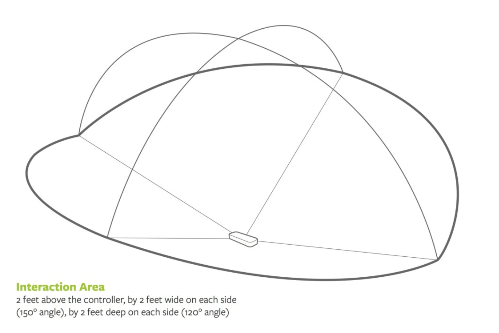

# Project Post 2 

`@Postdate: Mar 9th (Sat)`

## Project Title

Theremin Jacket

## Project Team

Junda Chen, Jeff Ma, Yudong Huang, William Black

## Major aspects for Development

- Sensor
  - Sonar Sensor
  - Leap Motion
- Arduino/Other interface & Software Design
  - MIDI Software
  - Storage
  - Data Transfer
- Clothes Design
  - Sensor/Leapmotion embedding
  - Light Design
    - LED
    - Covering Material / Defussing material (Potentially)
  - Jacket

## Weekly Accomplishments

- [x] Setup sonar sensor tracking in Arduino Mega.
- [x] Use sonar sensor to build a prototypical MIDI device.
- [x] Leap Motion Mechanism
  - [x] How leap motion works, Accuracy, General application
  - [x] HW and SW. Compatilibility to IoT Devicess
- [ ] 3D PrintLeap Motion case
- [ ] First software prototype for theremin
  - [ ] Motion trace: proximity and height change
  - [ ] Data Transfer and MIDI encode/decode
  - [ ] Run on Arduino/Raspberry pi
  - [ ] (Optimization) De-noise.
- [ ] Select a jacket.
- [ ] Design the jacket.

## Image/Video

## Changes to our approach

We originally want to design the primitive circuit and sensors to make the sensing work. William has just worked out the sonar in wednesday, and as a backup plan and primitive approach we will design a theremin using the sonar sensors and integrate it as a part of jacket.

In search for potential improvement of gesture recognition, we also focus our attention on Leap Motion. On leap motion, we're able to capture richer and more sensive gesture information — able to grab, tremble, drastically move up and down, within its well-defined range of service. 

## Material list

- [ ] Circuit Board: (Potentially) MIDI encode/decoder, Leap motion image processor, 
  - [ ] ~~Arduion (1):~~
  - [x] Circuit Playground (1)
  - [ ] [Raspberry Pi 3B +](https://www.amazon.com/ELEMENT-Element14-Raspberry-Pi-Motherboard/dp/B07BDR5PDW/ref=sr_1_3?crid=130OBI1IAILPI&keywords=raspberry+pi+3+b%2B&qid=1552169577&s=electronics&sprefix=raspberry+pi%2Celectronics%2C139&sr=1-3) (1, with toolkits): $30-50
- [ ] [Leap Motion](https://www.amazon.com/Leap-Motion-Controller-Packaging-Software/dp/B00HVYBWQO/ref=pd_rhf_gw_p_tnr_1) (1): $96
- [ ] LED Strip light (2, TBD)
- [ ] A Jacket (1, TBD)

------

## Development Log

[Cylon.js](https://cylonjs.com/documentation/examples/cylon/annotated/leap_arduino/): an arduino API to control the leap motion

[Adafruit strip LED](https://www.adafruit.com/product/2824?length=1) : a $17.99 

Leap Motion installation: Trouble shooting in Windows.

Stability and range: Use distant infrared LED to increase light detection stability in distance thus increase range.

Potentially position Leap Motion in one side of chest to achieve proper motion detection

Testing: Can us v from horizontal mode to VR mode

Design idea: infrared light and visible light design and position
